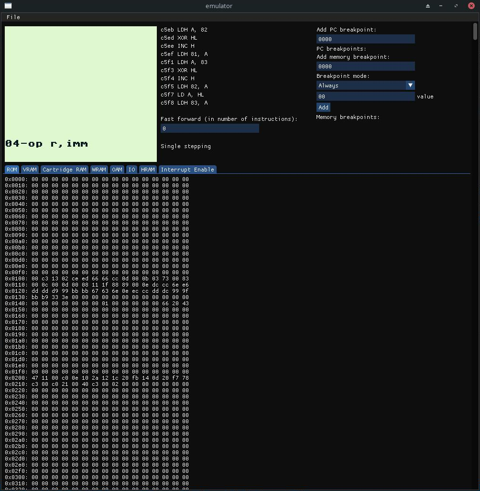

# GameboyEmulator
A gameboy (DMG model) emulator.

## Current status

### Implemented:
- CPU instructions
- Hardware timer (implementation might have some bugs in it, as instr_timing test is failing due to the timer)
- Basic memory emulation (some memory-mapped IO registers are implemented as normal RAM)
- Interrupts

### Partially implemented:
- PPU (implementation is a work in progress: mostly works, but is highly inaccurate and has some bugs)

### Features:
- Memory view
- Instruction breakpoints
- Memory breakpoints
- Single stepping
- Instruction and CPU registers logging
- Emulation fast-forwarding

The project was tested on Windows and Linux using unit tests and test ROMs (blargg's test ROMs were used). Note that version at `dev` branch might not pass all tests (you should use version at `stable` branch instead).

## Dependencies
 - GLAD
 - GLFW
 - Dear ImGui
 - Catch2
## Building
Run cmake at project's root directory. C++20 is required for building the project.
## Testing
Tests' source code is located under src/tests directory. To build tests add `-DBUILD_TESTS=ON` flag when generating build files. Tests can be run with ctest. When running tests' executable directly, make sure to launch it from src/tests/intergation/roms directory as this is where test ROMs are located.

## Usage notes

- Breakpoints are removed by pressing backspace while hovering over them.
- To see CPU status during some instruction, click on the instruction.
- Currently only 10 most recent instructions can be logged.
- To toggle single stepping or to resume execution after a breakpoint, press spacebar.

## Screenshots

## TODO list
- instr_timing test is currently failing
- PPU implementation has some bugs
- Make PPU emulation more accurate
- Implement at least some of the MBC
