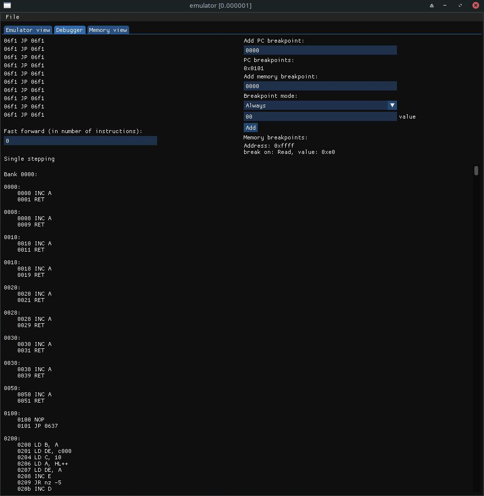

# GameboyEmulator
A Game Boy (DMG model) emulator.

## Current status

### Implemented:
- CPU instructions
- Hardware timer
- Basic memory emulation (some memory-mapped IO registers are implemented as normal RAM)
- Interrupts
- Basic MBC1 chip support

### Partially implemented:
- PPU (implementation is a work in progress: mostly works, but is highly inaccurate, sprites are yet to be tested)

### Features:
- Memory view
- Instruction breakpoints
- Memory breakpoints
- Instruction and frame stepping
- Instruction and CPU registers logging
- Emulation fast-forwarding

The project was tested on Windows and Linux using unit tests and test ROMs (blargg's test ROMs were used). Note that version at `dev` branch might not pass all tests (you should use version at `stable` branch instead).

## Dependencies
 - GLAD
 - GLFW
 - Dear ImGui
 - Catch2
## Building
Run cmake at project's root directory. C++20 is required for building the project.
## Testing
Tests' source code is located under src/tests directory. To build tests add `-DBUILD_TESTS=ON` flag when generating build files. Tests can be run with ctest. When running tests' executable directly, make sure to launch it from src/tests/intergation/roms directory as this is where test ROMs are located.

## Usage notes

- Breakpoints are removed by pressing backspace while hovering over them.
- To see the CPU status during some instruction, click on the instruction.
- Currently only 10 most recent instructions can be logged.
- To stop/resume execution press spacebar.
- Press F11 while execution is stopped to advance a single instruction, press F12 to advance a frame.

## Tests status

All blargg's tests for CPU instructions as well as instr_timing.gb and memory access timing tests are passing. See src/tests/integration/roms/blargg_test_roms for list of tests. Work is being done for passing some of the mooneye test suite roms.

## Screenshots

## TODO list
- Properly test PPU
- Make PPU emulation more accurate
- Sprites are not displayed
- Emulator completely fails mooneye tests for MBC1 chip, although it works fine with some banked blargg test roms.
